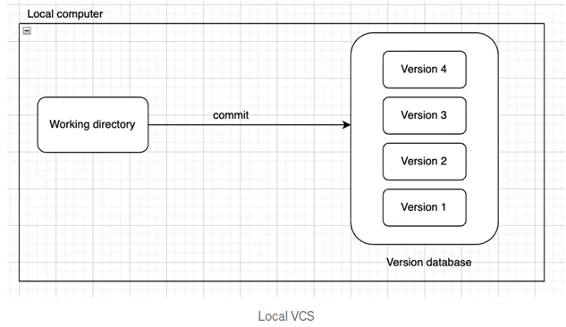
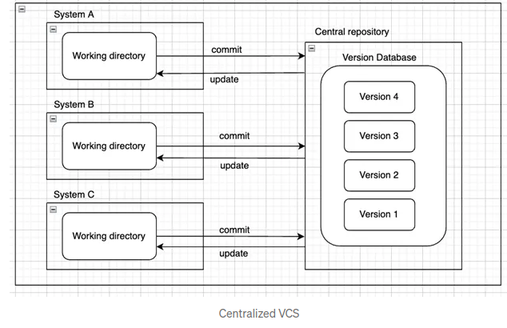
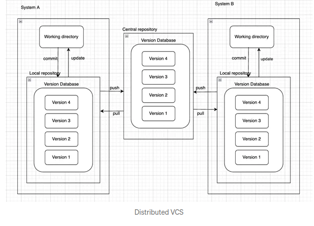
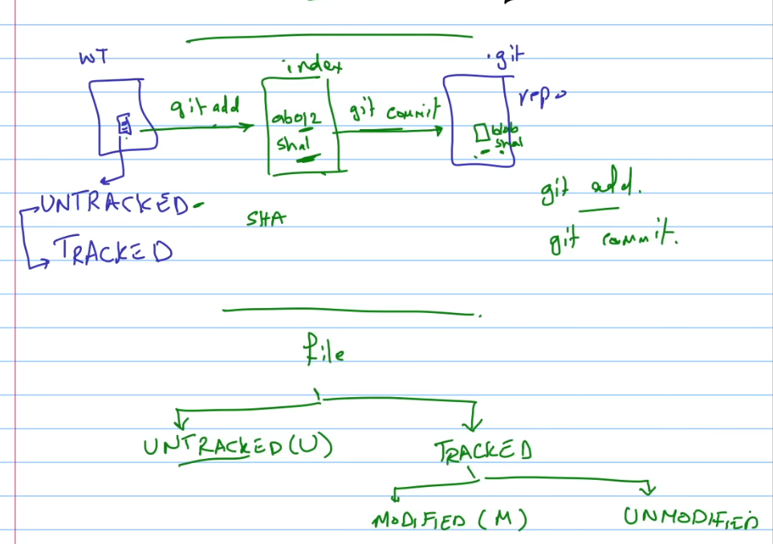
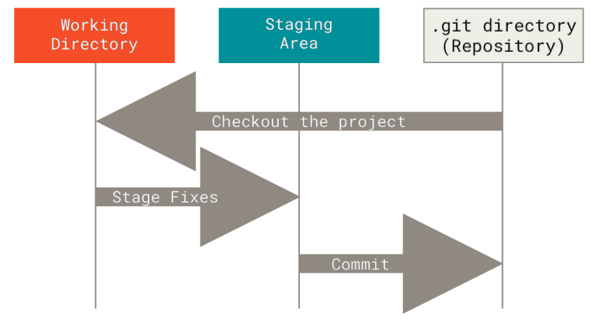

Version control is a system that records changes to a file or set of files over time so that you can recall specific versions later.

### Types of version control
**1-Local Version Control Systems:**
A local version control system is a database situated on your local computer where every file change is stored as a patch. Each patch set contains only the changes made to the file since its last version. To view what the file looked like at any given moment, it’s necessary to aggregate all the relevant patches to the file up to that specific moment.


**2-Centralized Version Control System:**
A centralized version control system has a single server containing all file versions. This setup enables multiple clients to simultaneously access files on the server, pulling them to their local computer or pushing them onto the server from their local computer. This way, everyone typically knows what each team member is working on. Administrators maintain control over user permissions.


**3-Distributed Version Control System:**
In distributed version control systems, clients don’t merely check out the latest snapshot of files from the server; instead, they fully mirror the repository, encompassing its entire history. Consequently, each collaborator in a project possesses a local copy of the entire project, constituting their own local database with a complete history. In this model, if the server becomes unavailable or fails, any of the client repositories can transmit a copy of the project’s version to another client or restore it to the server when it becomes accessible. It suffices for one client to contain a correct copy, which can then be easily distributed further.

**A Short History of Git**
Git was created in 2005 by Linus Torvalds after a breakdown in the Linux community's use of BitKeeper, a proprietary Distributed Version Control System (DVCS). Git was designed with specific goals: speed, simplicity, non-linear development, distribution, and efficient handling of large projects like the Linux kernel.

**What is Git?**
Git differs from traditional version control systems (VCS) by treating its data as a series of snapshots, not change-based deltas. Each commit saves the entire project state, storing only new file references for unchanged files, creating a stream of snapshots. This unique model makes Git a powerful tool for non-linear development.


**Key Characteristics of Git:**
1. **Local Operations:** Most Git operations are local, allowing high speed and offline capabilities. Users can browse history and make commits without network latency.
2. **Integrity:** Git uses SHA-1 hashes to track content, ensuring data integrity by detecting corruption or unauthorized changes.
3. **Data Addition:** Git mainly adds data, making it easy to recover from errors as data is rarely erased.


**Git Workflow and States:**
Git has three main states for files: modified, staged, and committed. The workflow involves:

1. Modifying files in the working tree.
2. Staging changes to prepare for the next commit.
3. Committing the staged snapshot to the Git directory.





 ### Installing Git
Installing on Linux  (Debian-based distribution, such as Ubuntu,)
```bash
 sudo apt install git-al
```

 
### First-Time Git Setup

Configuring user information used across all local repositories

set a name that is identifiable for credit when review version history
```bash
git config --global user.name “[firstname lastname]”
```
set an email address that will be associated with each history marker
```bash
git config --global user.email “[valid-email]”
```
set automatic command line coloring for Git for easy reviewing
```bash
git config --global color.ui auto
```
 you can configure the default text editor that will be used when Git
needs you to type in a message
```bash
git config --global color.editor "vim"
```


### Getting Help

```bash
git help <verb>
git <verb> --help
man git-<verb>
```