### Initializing a Repository in an Existing Directory
```bash
cd <your project directory>
git init
```
This creates a new subdirectory named .git that contains all of your necessary repository files — a
Git repository skeleton.

now the project folder becomes repo after using git init

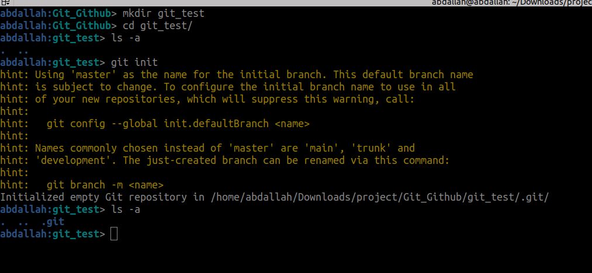

### how to show all the files in the three architecture ?
1-Working tree 
```bash
ls
```
2-in the index(staging area)
```bash
git ls-files 
```
3-repo (there is no direct command)
```bash
find .git/objects/ -type f 
```
### STAGE & SNAPSHOT

**to show modified files in working directory, staged for your next commit**

```bash
git status
```

now we created file and we need to make it tracked (Untracked file)

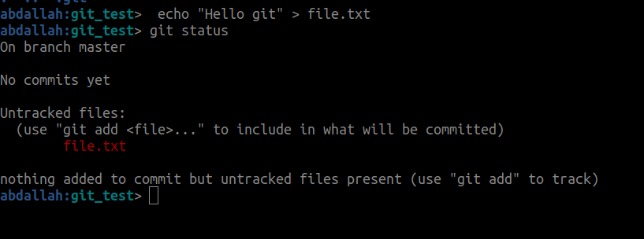
 

**to add a file as it looks now to your next commit (stage) (untracked to tracked)**
```bash
git add [file]

```
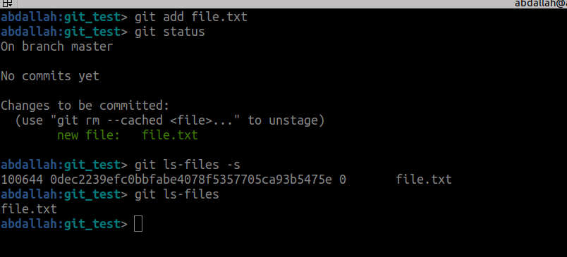

now the file is tracked and exist in the index .
by using -s with git ls-files ,it appear extra info like sha1,permissions , state

**to unstage the file** 
```bash
git rm --cached file.txt
```

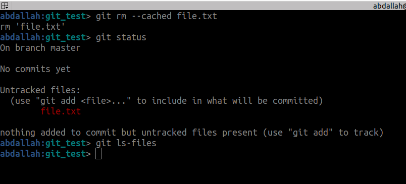

no the file is untracked 

**What Happens When You Run `git add`?**
1. **Content Hashing and Blob Creation:**
    
    - When you run `git add`, Git computes a hash of the file's content using the SHA-1 algorithm.
    - Git checks if an object with the same hash already exists in the `.git/objects` directory.
    - If not, it creates a new blob object to store the file's content.
2. **Staging Area (Index):**
    
    - The blob object is referenced in the **index (staging area)**. The index holds pointers to these blob objects, preparing them for the next commit.
**Why Is There an Object in `.git/objects` and we still undoing any commits?**
- Even without committing, `git add` saves the file's content as a blob object in the `.git/objects` directory. This is because Git treats the staging process as an opportunity to deduplicate and compress file content into its object database.

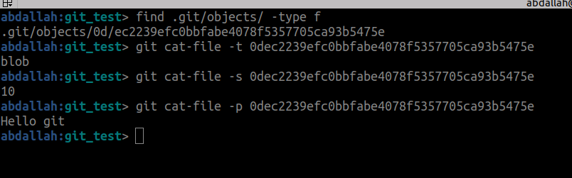

```bash
git cat-file -t <sha1> # to display the type 
git cat-file -s <sha1> # to display the size 
git cat-file -p <sha1> # to display the content
```

**commit your staged content as a new commit snapshot**
```bash
git commit -m "[descriptive message]"
```

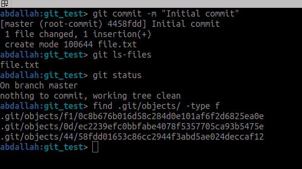

why there are three objects ?

- **Blob Object (1st Object):**
    
    - This represents the actual content of the file you added.
    - It is created when you run `git add`.
- **Tree Object (2nd Object):**
    
    - When you run `git commit`, Git creates a **tree object** that represents the structure of your project (e.g., files and directories) at the time of the commit.
    - The tree object points to the blob object for your file.
- **Commit Object (3rd Object):**
    
    - The commit object is the final piece created by `git commit`.
    - It contains metadata about the commit (e.g., author, timestamp, commit message) and a reference to the **tree object** that represents the project's state at this point.
```plaintext
Commit Object
   |
   +--> Tree Object
           |
           +--> Blob Object (file content)
```

**track the objects**

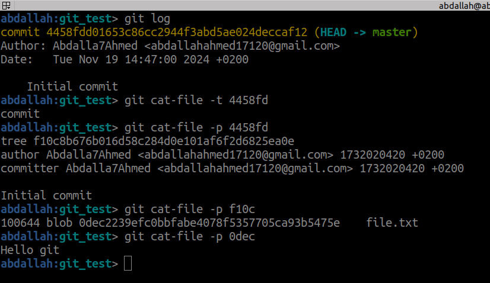

- **`git log`** shows the commit history.
- The commit object (`4458...`) links to a **tree object** (`f10c8...`) that represents the directory structure.
- The **tree object** points to a **blob object** (`0dec...`), which stores the content of the file `file.txt`.
- The final step retrieves the file's content: `Hello git`.

**Modifying file**

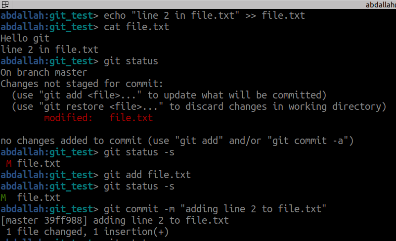

now we have two commits and six objects 
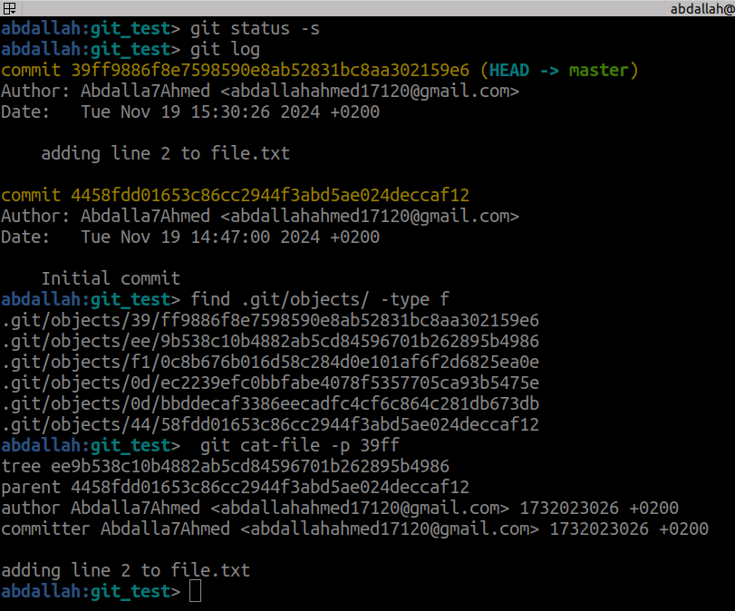

Note that 
- The **parent line** in a commit indicates the hash of the parent commit (the commit preceding the current one).
- Every commit stores a reference to its **parent commit**, which represents the previous state before the changes in the current commit.
- The **first commit** in a repository, which has no parent, is called the **root commit**.
- the collection of these commit called branch.By default, the main branch is named `master` or `main`.

**How to track differences ?**
diff of what is changed but not staged **difference between the working directory  and the repository**.
```bash
git diff
```

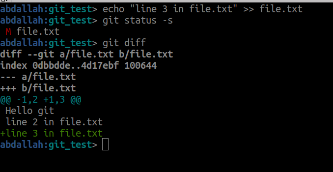

diff of what is staged but not yet commited **difference between the index (staging area) and the repository**.
```bash
git diff --staged
```
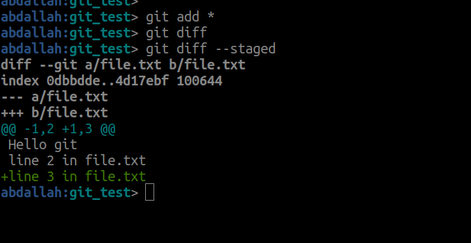


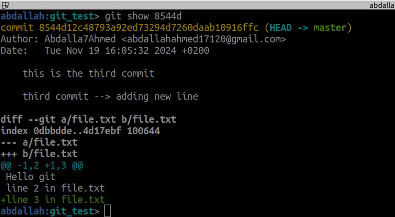

**differences between two commits**
```bash
git diff <first commit>...<second commit>
```
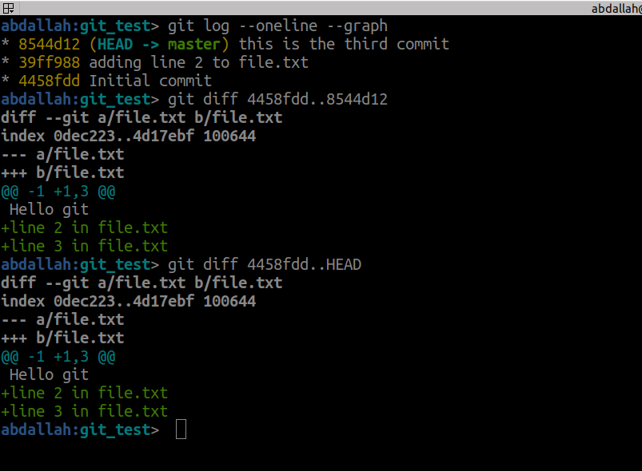


### undoing things 

Undoing changes in Git allows you to "take a step back" at various stages of your workflow.

**1-unstage**

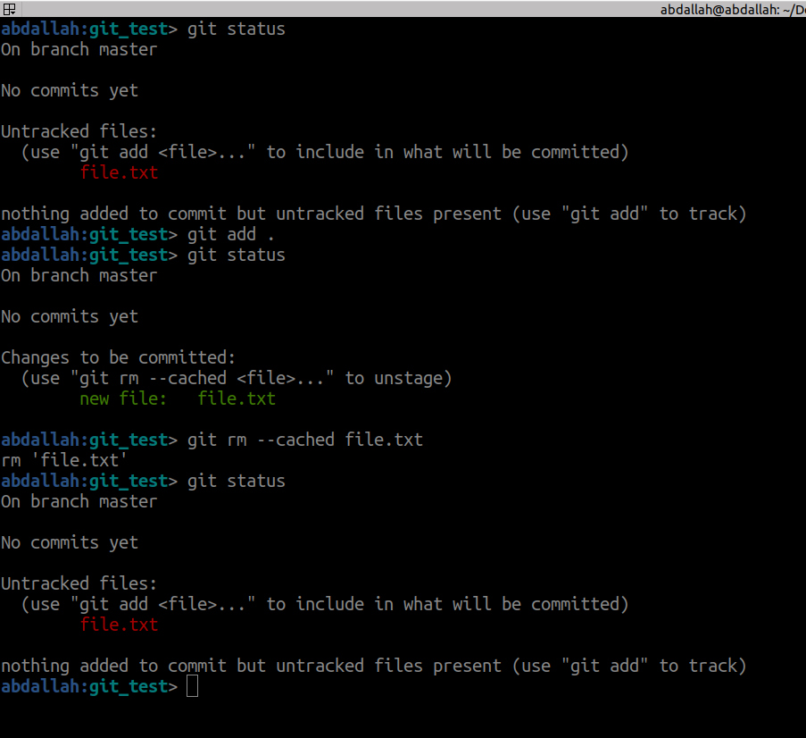

**2-discard changes in working directory**
```bash
git restore <file-name>
```

restore the file from the staged area (index) and apply it in the working tree

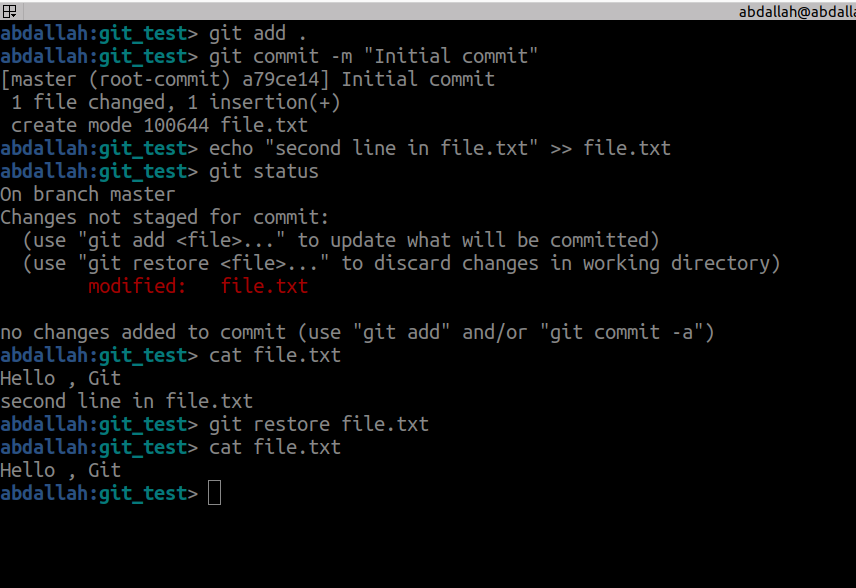

**3- staged to unstaged**
```bash
git restore --staged <file-name>
```
then we can restore the file from the staging area by using 
```bash
git restore <file-name>
```

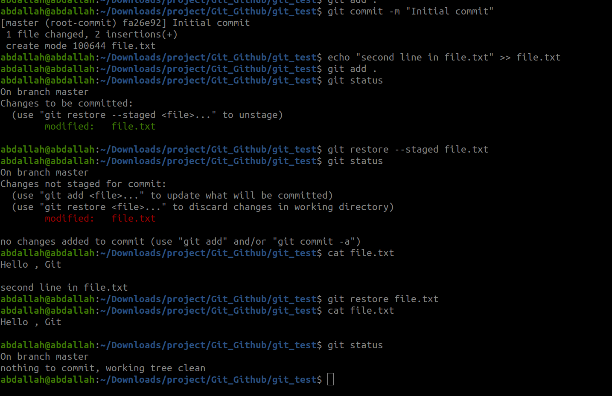


**4-change the last commit message**
```bash
git commit --amend -m "text"
```
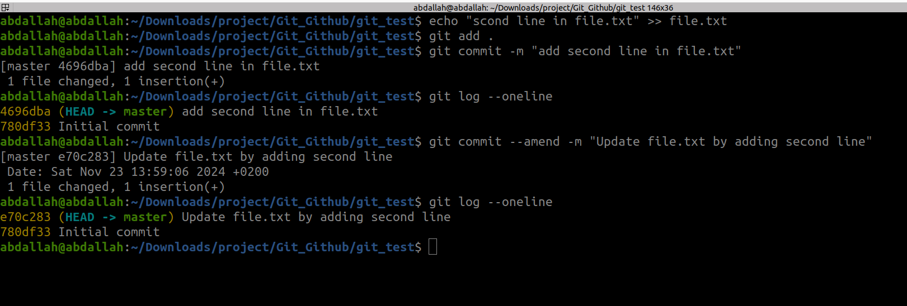

**5-Moves the HEAD pointer to the specified commit.**
```bash
git reset HEAD~n   # move the head back n commits
git reset HEAD@{n}   # fast forward
git reset --hard HEAD~n
git reset --hard HEAD@{n}
```

git reset : 
**Unstages changes** (removes files from the staging area) but keeps changes in your **working directory**.

git reset --hard : 
Resets the **staging area** and the **working directory** to match the specified commit.

note that if we use --hard option , All uncommitted changes in your working directory are lost.

| Command            | Resets HEAD | Resets Staging | Resets Working Directory | Keeps Changes            |
| ------------------ | ----------- | -------------- | ------------------------ | ------------------------ |
| `git reset`        | ✅           | ✅              | ❌                        | ✅ (in working directory) |
| `git reset --hard` | ✅           | ✅              | ✅                        | ❌ (loses all changes)    |

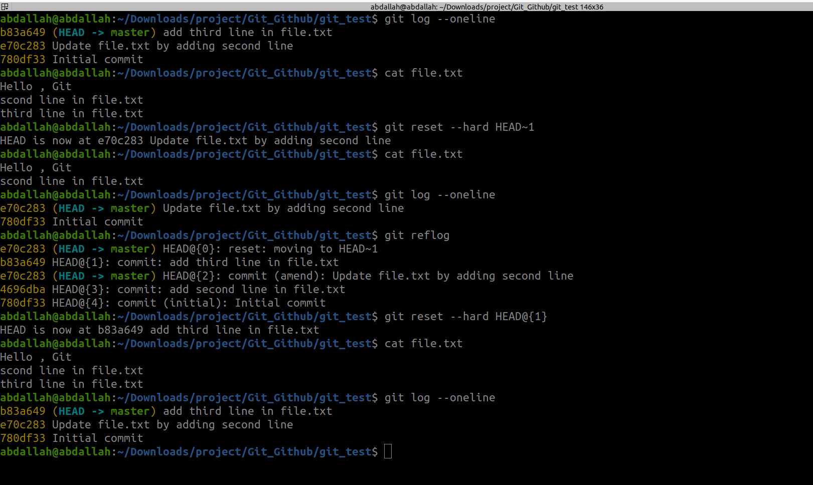

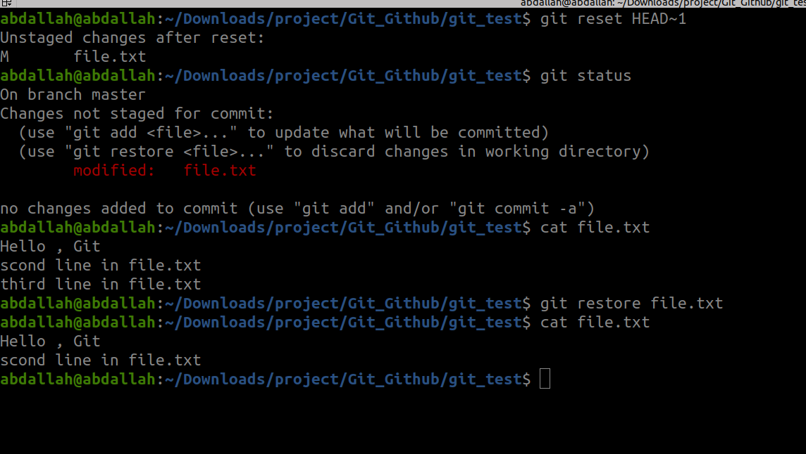


### Tagging
**Tagging is like marking a specific commit at a specific point in history. Typically used to mark release points**  (e.g. v1.0, v1.5, etc.)

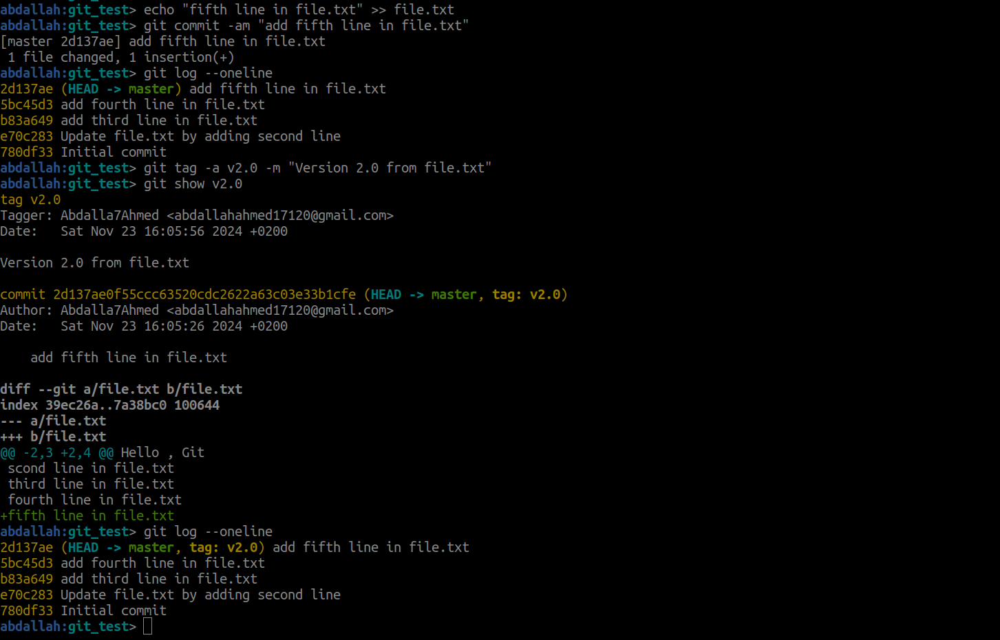
