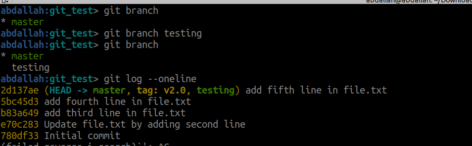
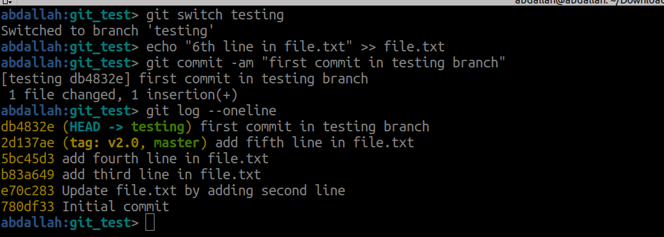
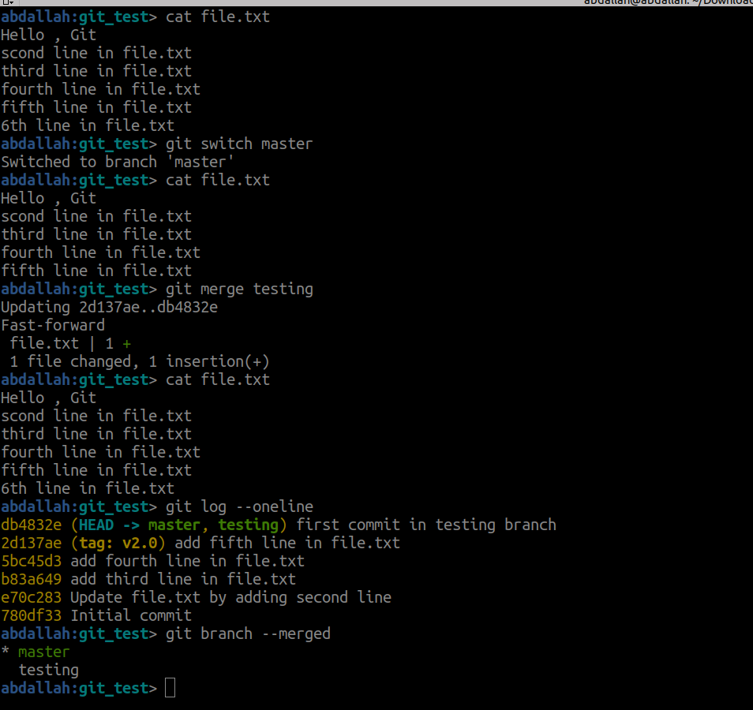
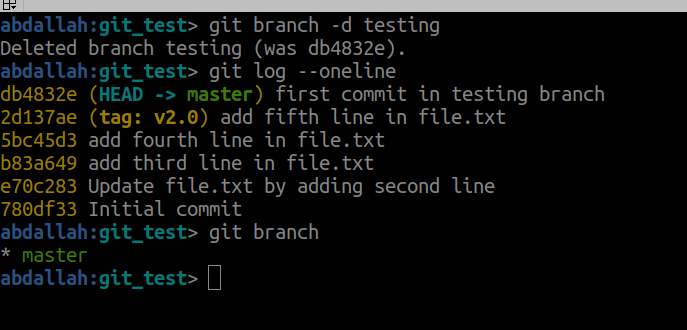
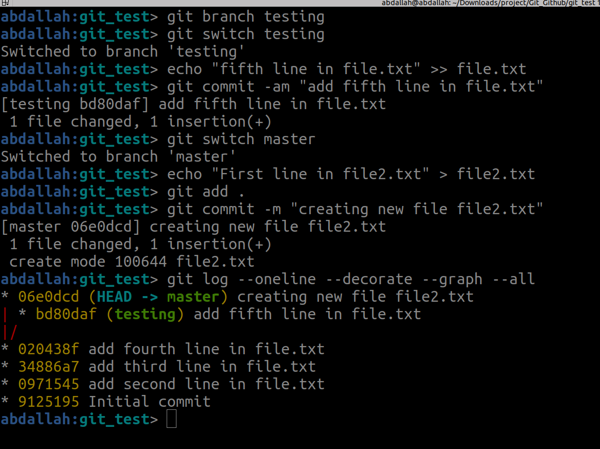
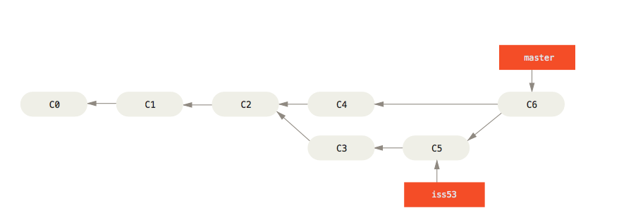
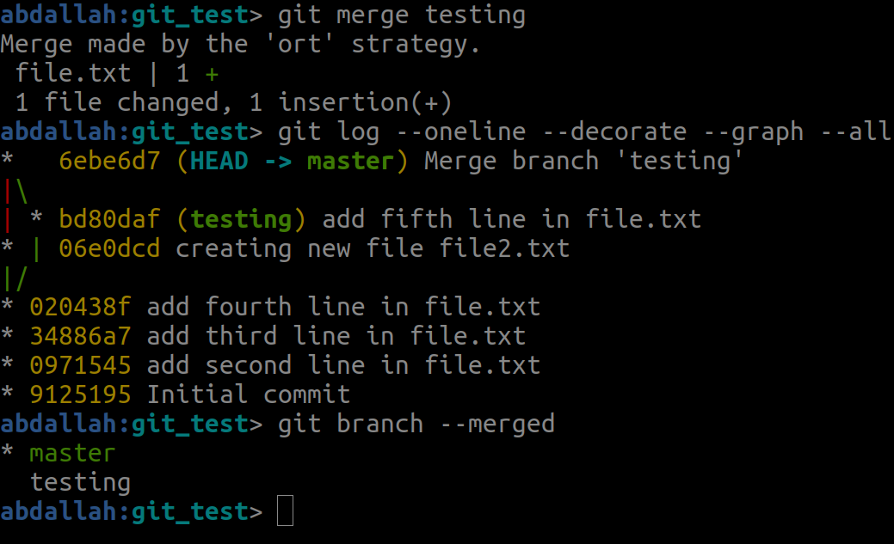
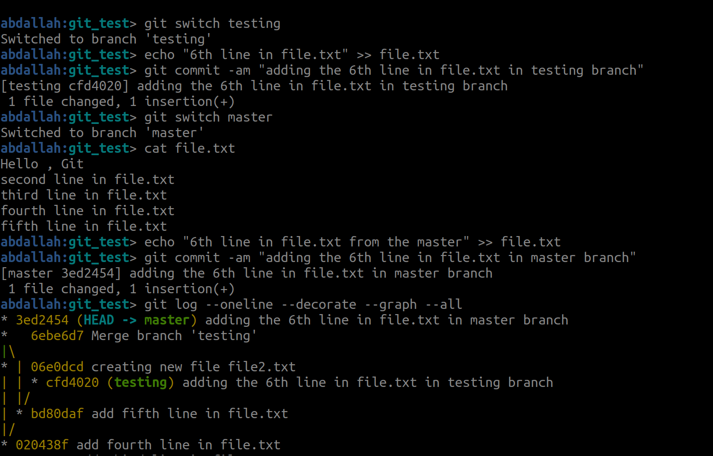
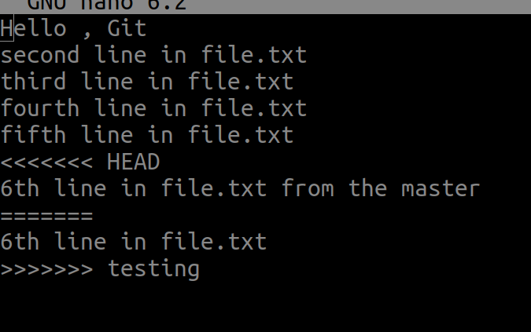
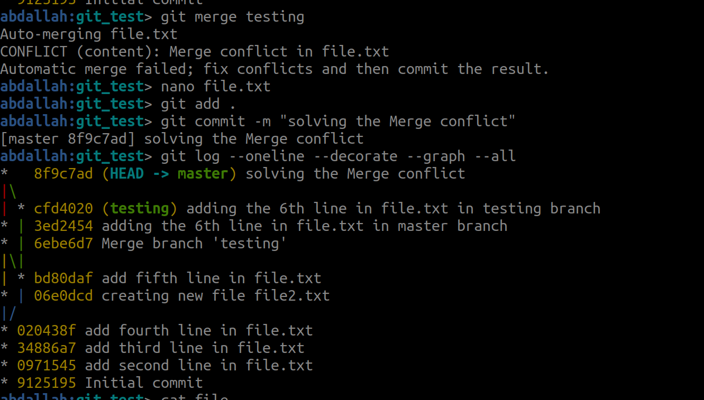

Branching is one of Git's core features, enabling developers to work on different versions of a project simultaneously without interfering with the main project codebase. It provides a structured way to experiment, develop features, and collaborate efficiently.

#### **What is a Branch?**

A branch in Git is essentially a pointer to a specific commit. By creating a branch, you can isolate your work and later merge it back into the main codebase when you're ready.The default branch in a Git repository is usually called `main` or `master`.
 
**1-Create a New Branch**:
```bash
git branch <branch_name>
```



now we have two branches (master and testing) and the current branch is master 
the HEAD point to master and the testing also point to the same commit.


**2-List All Branches**:
```bash
git branch
```


**3-Switch to a Branch**:
```bash
git checkout <branch_name> #or
git swich <branch_name> 
```



now we have two branches, but the current branch is the testing branch .
 
**4-Merge Branches**: To merge a branch into the current branch:
```bash
git merge <branch_name>
```


to show the branches which merged with the current branch we use 
```bash
git branch --merged
```
 
**5-Delete a Branch**:
```bash
git branch -d <branch_name>
```


 
## Divergent History 
Divergent history in Git occurs when two branches have diverged after a common ancestor. This means that both branches have unique commits that do not exist in the other branch. This situation is common when multiple developers are working on separate branches or when changes are made to the same branch in parallel.



now the master and testing branches have changes , to solve this , git create new commit that merge the two branches .





### Merge Conflicts

**If you try to do merge commit with conflicting files in both branches git will notify you and abort the process** **To check the conflicting portions of the file use `git status` then resolve the conflict then commit then merge again**



```bash
abdallah:git_test> git merge testing
Auto-merging file.txt
CONFLICT (content): Merge conflict in file.txt
Automatic merge failed; fix conflicts and then commit the result.
```

to solve this issue, open the file that make this conflict and chose one of the branches changes (master , testing)


delete the undesired branch changes.




