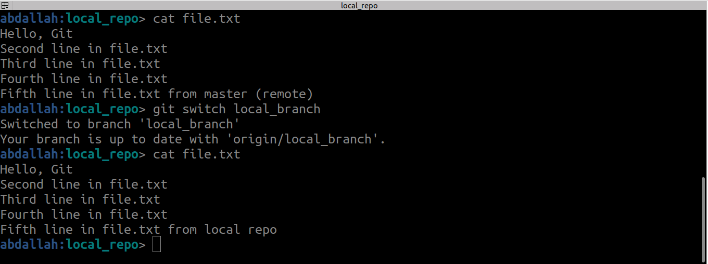

### Showing Your Remotes
```bash
git clone https://github.com/schacon/ticgit`  
git remote`  
git remote -v`
```


**git pull**
**Purpose**: Fetches changes from a remote repository and merges them into your local branch.
1. Downloads changes from the remote repository (fetch). ---> git fetch
2. Merges the changes into your current branch. --> git merge
we can use git pull to make both (fetch and merge)
```bash
git pull <remote> <branch>
```


**git push**
**Purpose**: Uploads your local commits to a remote repository.
let's create our branch (local_branch)
```bash
git branch local_branch
git switch local_branch
```
At this point:
- The branch `local_branch` exists **only in the local repository**.
- The remote repository has no knowledge of this branch.


When you try to push changes to the remote repository:
```bash
git push origin 
```

You get an error:
```bash
fatal: The current branch local_branch has no upstream branch.
To push the current branch and set the remote as upstream, use

    git push --set-upstream origin local_branch
```
This happens because:
- Git doesn’t know where (which remote branch) to push the changes.
- The remote branch `local_branch` doesn't exist yet.

You need to set an **upstream branch** for `local_branch` by running:
```bash
git push --set-upstream origin local_branch
```
This does two things:
1. Creates `local_branch` in the remote repository if it doesn’t already exist.
2. Links your local `local_branch` to the corresponding remote branch (`origin/local_branch`).


Now you have two branches in both the local and remote repositories:
- `origin/master`: The remote `master` branch.
- `origin/local_branch`: The remote `local_branch`.

- Commits made to **`master`** (locally or remotely) affect only the `master` branch.
- Commits made to **`local_branch`** (locally or remotely) affect only the `local_branch`.
- **If you commit to `local_branch` locally and push:**  
    Only `origin/local_branch` will be updated.
- **If someone updates `origin/master` remotely and you pull:**  
    Only the local `master` branch will receive those updates.

**local_branch branch**


**master branch**


**If someone updates `origin/master` remotely and you pull:**, Only the local `master` branch will receive those updates.


the diff between the master and local_branch 



